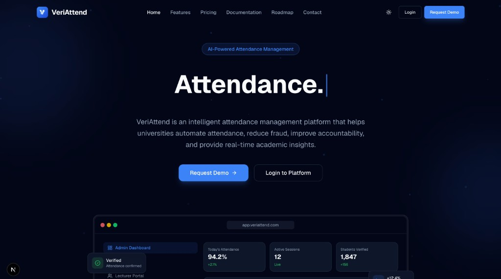
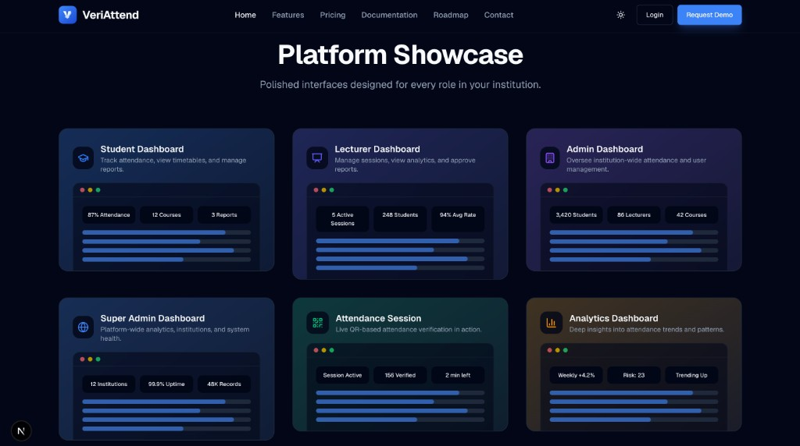

# VeriAttend Marketing Website

Official public-facing marketing website for **VeriAttend** — an AI-powered attendance management platform for universities and higher education institutions.

> Attendance. Verified. Smarter. Simpler.






## Tech Stack

- **Next.js 16** (App Router)
- **TypeScript**
- **Tailwind CSS v4**
- **Shadcn UI** (custom components)
- **Framer Motion**
- **Lucide Icons**
- **next-themes** (dark/light mode)

## Getting Started

```bash
npm install
npm run dev
```

Open [http://localhost:3000](http://localhost:3000) in your browser.

## Scripts

| Command | Description |
|---------|-------------|
| `npm run dev` | Start development server |
| `npm run build` | Create production build |
| `npm run start` | Start production server |
| `npm run lint` | Run ESLint |

## Sections

- Sticky navigation with blur & scroll shrink
- Hero with animated dashboard mockup
- Trusted By (placeholder institutions)
- Problem statement
- Feature cards (Student, Lecturer, Admin, Super Admin)
- AI Features (Coming Soon)
- How VeriAttend Works workflow
- Platform screenshot showcase
- Product roadmap timeline
- About the developer
- Technology stack
- Testimonials (demo content)
- FAQ accordion
- Contact form
- Footer

## Deploy

Deploy to [Vercel](https://vercel.com) with one click, or run `npm run build && npm run start` for self-hosting.

---

Built with passion by **Patricia Shiloh Kanneh**
